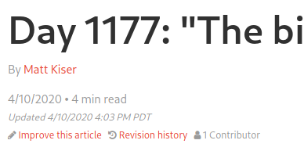
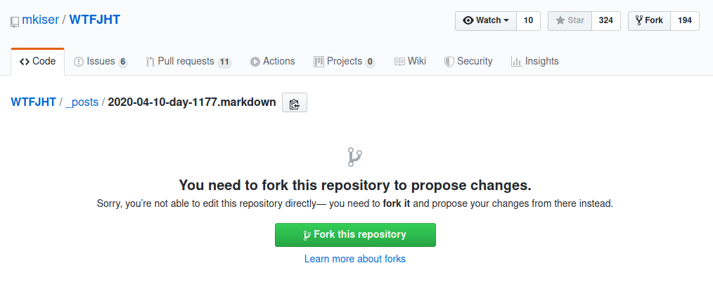
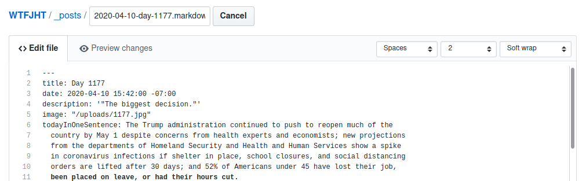
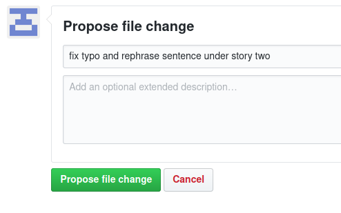
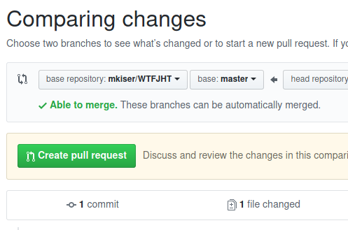
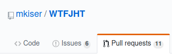

# How to contribute a copyedit

Someone's gotta catch spelling mistakes and other shit ~before~ after it hits the press, right?
Well, I'm glad it's you! 💪

#### Before Submitting A Copyedit

If you haven't already, start by making a Github account.
[You can do that here.][github-signup]

A Github account allows you to interact with Github repositories (such as this one!)
by submitting issues, commenting, and of course, submitting pull requests.

If you want a primer on how Github, or it's underlying technology "git" works,
[How-To Geek has a good article here.][how-to-geek-article]

#### How To Submit A Copyedit

Once you have a Github account, the next part is cake. 🎂

The easiest way to contribute to WTFJHT is [through our website.][wtfjht-website]

1. Navigate to the article you would like to edit and click on "Improve this
   article."

   

1. Next, Github will prompt you to fork this repository. Click on "Fork this
   repository" to proceed. You will only need to do this once.

   

   > [Learn about what a "Github fork" is here.][github-fork-docs]

1. Awesome! Now that you have a fork set up, make the changes you want to make
   in the code editor provided.

   

1. Once you've made all the changes you would like, craft a message describing
   your changes and press "Propose file change."

   

   > If you want to read more on how to write a commit message, a good article
   > outlining some good starting points [can be found here.][commit-message-article]

1. At this point, your changes are ready to go! To submit your changes, we need
   to create what's called a "pull requests" in Github. In simplest terms, this
   allows you to propose your changes in a format that we can review prior to
   accepting your change. Once you click on "Propose file change," you should
   be on a page titled "Comparing changes." Press "Create pull request" to
   continue.

   

   > If you would like to know more about pull requests, [check out Github's documentation here.][github-pr-docs]

1. From here, you can title your pull request and provide some context as to why
   you made the change. How you structure a pull request is up to you,

   > Pro tip: Adding animated gifs or images to your pull requests gives you
   > cool points. 💯😎 You can do this by adding the following code anywhere
   > you'd like to flex your gif / image muscles:

   ```markdown
   
   ```

1. Good job, friend! 🙋‍♀️ Now, we wait. Once a repository maintainer
   approves your work, they will merge in your changes! We may have questions
   for you, so check in with your pull request by clicking on the "Pull
   Requests" tab in the project repository. By default, Github will send you
   updates over email as well.

   

1. Thank you for your effort! 🙏❤️ 
   Taking the time out of your schedule to help improve WTFJHT is immensely
   appreciated and helps us continue providing quality content for all of our
   readers. Please reach out if we can improve this documentation or if there's
   anything we can clarify. 😀


[github-signup]: https://github.com/join
[how-to-geek-article]: https://www.howtogeek.com/180167/htg-explains-what-is-github-and-what-do-geeks-use-it-for/
[wtfjht-website]: https://whatthefuckjusthappenedtoday.com/
[github-fork-docs]: https://help.github.com/en/github/getting-started-with-github/fork-a-repo
[commit-message-article]: https://chris.beams.io/posts/git-commit/
[github-pr-docs]: https://help.github.com/en/github/collaborating-with-issues-and-pull-requests/about-pull-requests
